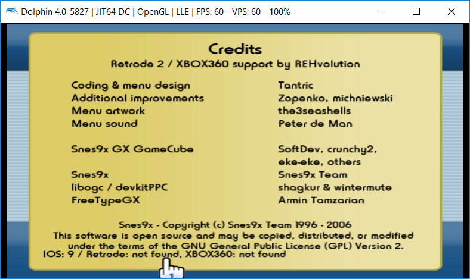

### Snes9x GX with Retrode and XBOX360 controller support

### Retrode 2 ###
* Play your original SNES cartridges on your Wii using your original SNES controllers!
* The [Retrode 2](http://www.retrode.org) cartridge reader offers USB mass storage access for your SNES cartridges. This works out of the box on the Wii!
* With my driver you can also use your SNES gamepads on your Wii!
* Support for 4 players!
* Tested with various games: Super Mario World, Yoshi's Island, Streetfighter 2, Mortal Kombat, Doom, Wolfenstein, Super Bomberman...

### XBOX360 controller ### 
* Only XBOX360 **wired version** is supported (VID=0x045e, PID=0x028e)
* **NOTE:** You cannot use USB drives and an XBOX360 controller at the same time! Don't try it: Snes9x GX will freeze!
* Currently only one XBOX360 controller is supported.
* You can switch players by pressing the XBOX button. The LED shows which player is selected. _On some controllers the LED always flashes, so it's hard to know which player you have selected..._

### HOWTO ###
* Connect your Retrode 2 or XBOX360 controller, then start Snes9x GX.
* To make sure the controller was correctly detected click on the logo, which opens the credits screen. See screenshot below.
* Do not unplug your controller once it is detected!

### Notes
* Original SNES Mouse is not supported. (I don't have one, but if you give me the RetrodeTest output I could add it...)
* I also maintain the [RetroArchWiiRetrode](https://github.com/revvv/RetroArchWiiRetrode/) fork.

#### Download
* [snes9xgx-retrode-xbox360-0.4.zip](https://github.com/revvv/snes9xgx-retrode/releases/download/0.4/snes9xgx-retrode-xbox360-0.4.zip)
* [RetrodeTest-0.1.zip](https://github.com/revvv/snes9xgx-retrode/releases/download/0.1/RetrodeTest-0.1.zip) 

### Disclaimer
The author of the Retrode USB Wii driver is not afflicted with [Retrode.org](http://www.retrode.org) or [DragonBox Shop](https://www.dragonbox.de/en/accessories/cartridge-dumper/retrode-2-cartridge-dumper), but is a huge fan ;-)
This software comes without any warranty. I am not responsible for any damage to your devices.
